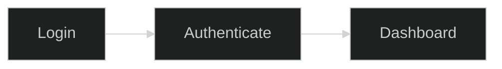
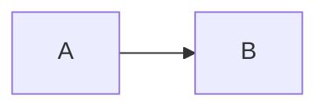

# Per-diagram initialization

```mermaid {width=80% align=center caption="Dark login flow"}
%%{init: {"theme": "dark", "flowchart": {"curve": "linear"}}}%%
flowchart LR
  Login --> Authenticate --> Dashboard
```

```mermaid {theme=forest caption="Global isolation"}
flowchart LR
  A --> B
```
